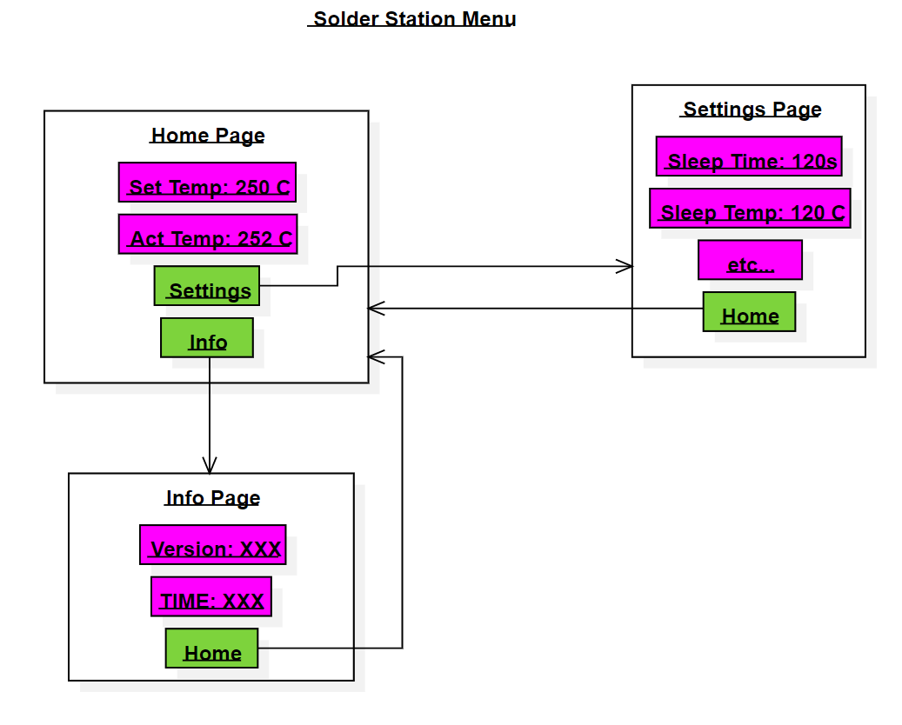

# Architecture

## Basic Premise

The end goal of sgl is to make the menu in your head into a functioning software
component with the minimum amount of structural reorganizing and thinking required.
The structure of the data should reflect the structure of the idea.

Consider this example menu below for a soldering station. It is just a quick
sketch but I'm sure you probably have drawn something similar to get a clear
visualization for your menu.

The menu consists of three pages (white boxes). The pages are made up of multiple
entries (sgl calls these **items**). Only one page is showing at any time.
**Items** (pink and green boxes) can be scrolled through and can have wildly
different functions, from displaying text (pink) to linking together pages (green).
One **item** is the currently selected item, as one is used to in such menus.
This **item** is the one user input will act upon. sgl calls this the ``current item`` of a page.

In the end, we have three layers:

1. The items, which are the smallest 'unit of functionality'. They represent
   individual entries on a page.
2. The pages bundle up items. A page acts like an array of items structurally.
   A page does not contain subpages as items. The linking between pages is
   done with link items.
3. The menu contains the pages. The pages form a tree like structure, with a
   root page (in the example above this would be the 'Home Page').

## Implementation

This section will elaborate the differences between the conceptual model of a
menu described above, and the actual implementation.

### Menu

sgl provides the type sgl::Menu. It implements a menu, i.e. contains pages and
relays the user input to them.

Above, the pages form a sort of tree. sgl takes a slightly different approach
in the implementation. Because no page ever owns a subpage, the tree structure
can be flattened with the link items preserving the tree structure. The flat
container used for storing the pages is a [sgl::NamedTuple](#NamedTuple).

This approach has some advantages over building a tree with nodes:

- The pages can be independent and reusable.
- The full type of a page is is preserved, because the NamedTuple functions like
  a std::tuple.
- Using NamedTuple it is possible to detect linking errors between pages at compile
  time while still keeping them standalone. This means that pages containing links
  can be constructed with  on their own without any errors. However, if the page
  is added to a menu and the links do not link to any other page in the menu, then
  a ``static_assert`` is triggered.
- Pages cannot be added at runtime. The number of pages is fixed when constructing
  a menu.
- The root page is flexibly set, i.e. the menu can be initialized with any of its
  pages as the current page.

The disadvantage would be that some template programming is required to implement
this. The library user however does not need to worry. sgl::Menu also has a
runtime interface to access the current pages (and its items) content besides
the compile time indexing, so no template programming is required from the
library users perspective.

### Pages

Another type sgl provides is sgl::Page. It implements a page. A page conceptually
is a flat container of items. sgl also uses a [sgl::NamedTuple](#NamedTuple) to
hold the items in a page.
A page cannot have another page as an item. A page only contains items.
To have a subpage, use sgl::PageLink instead.
The items can be accessed with compile time indices, like in a sd::tuple, or with
runtime indices. With the runtime indices, only the text and the name of an item
can be accessed.

### Items

Items represent a single line in the display. There really aren't any other
requirements other than being able to handle [inputs](input_handling.md) and
[ticks](external_updates.md). As such, sgl uses a simple concept for an Item,
which can be checked [here](concepts.md#item). sgl provides various classes
implementing this concept for different uses. Some examples are:

- [sgl::Boolean](#sgl::Boolean) for items representing a boolean value.
- [sgl::Numeric](#sgl::Numeric) for items representing a numeric value.
- [sgl::Enum](#sgl::Enum) for items with limited value range, like enums.
- [sgl::Button](#sgl::Button) for items with button like behavior.
- [sgl::PageLink](#sgl::PageLink) for linking between pages.
