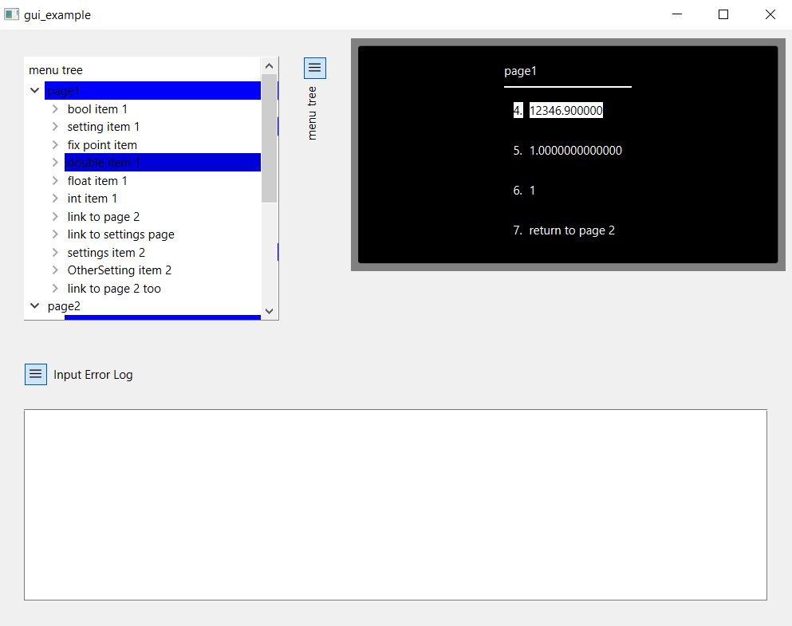
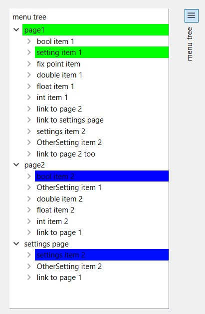
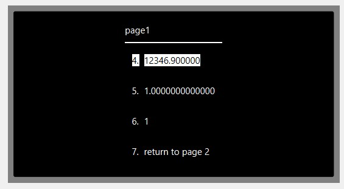
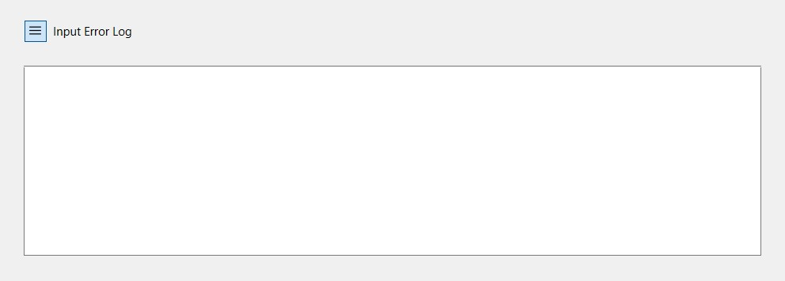

# Qt Visualizer

The qt visualizer allows for debugging a menu without deploying it on an mcu without writing much code. An screenshot of an example is shown below.



To build the same example, configure the meson project with the example option set to enabled and the gui option set to true. This will compile and link the [qt_main file](/example/qt_main.cpp) in the example folder and produce an executable called 'gui_example'. See [this section](visualizer.md#building-the-visualizer-without-meson) for building the visualizer without meson.

## Components

The visualizer consists of three parts.

### Tree view

In the top left is a tree view of the whole menu. The current page and the current item of a page are marked in blue. When an item is being edited, the item and its page are marked in green. You can also double click a page entry to make it the current page, as well as double click an item entry to make it the active item. Below you can see that setting item 1 on page 1 is being edited.


### Display

The top right shows a rendering of the display. This can be used to visually check if the menu works as expected. It displays the active pages name at the top, as well as the text of its items in a list. The number of lines of the display rendering is configurable.


### Error log

The bottom part of the gui contains an error log. Every time the menus handle_input returns an error other than sgl::error::no_error, it will display the error as well as the input that caused it.


### input

input to the menu is given through the keyboard, where alphanumeric inputs are forwarded as a char inputs to the menu under test. The up, down, left and right arrows as well as the enter key are forwarded as their sgl::input equivalents.

## Debugging your own menu

To be able to debug your own menu, a cpp file with the following content:

```cpp
#include "sgl/qt/mainwindow.hpp"
#include <QApplication>

constexpr size_t num_lines = 4;//number of lines the display should have

int main(int argc, char** argv) {

  QApplication        app(argc, argv);

  sgl::qt::MainWindow window(sgl::Menu{...}, num_lines);

  window.show();

  return app.exec();
}
```

Then build the cpp file and link it with sgl. You now have built your menu debugger.
In meson, you would simply add this line to your build definition:

``executable('menu_debugger', 'main.cpp', dependencies: sgl_dep)``

Note that currently, the display width cannot be set. It just shows the whole text of an item. Only the number of lines can be configured.

## Building the visualizer without meson

If you don't want to use meson, but still want the qt visualizer, you will have to do the following:

1. Pass all header files in the `include/sgl/qt` subfolder (except menu_tree.hpp) to moc and generate the necessary source files with the macro `SGL_BUILD_LIB` defined.
2. Compile the qt resource file `include/sgl/qt/resources/section.qrc` with the Qt rcc.
3. Compile all cpp files in the `include/sgl/qt` subfolder and the generated sources from the previous steps and link them into a library. You will also have to define the macro `SGL_BUILD_LIB`, most easily done by passing `-DSGL_BUILD_LIB` as a command line argument to the compiler.
4. Now link this library with your compiled main and you will have your own menu debugger.
5. Done.

If the instruction above are unclear, have a look at the meson.build file located in `include/sgl/qt`. Even if you don't know meson, it should be very clear what is done.
