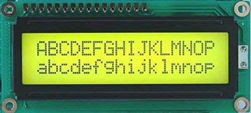

# Static Gui Library
Welcome to this repository. It contains the source code for sgl, the static gui library for character base lcd displays. This is still a work in progress, documentation and testing is not complete yet, as well as some feature missing or being buggy.



## About
I wanted to create a solution for making gui menus for fixed-width, line based displays on microcontrollers. These types of displays are very simple to communicate with and good for prototyping, but coding a useable menu for them isn't trivial and can quickly become a hardcoded mess. I also didn't find any other libraries handling this task, so I wrote my own.

There are a few important points for me when I set out to write this library:
 - no dynamic allocations
 - declarative style
 - constexpr everything possible
 - easily customizable behavior without inheritance
 - easily adaptable to new environment, i.e. changing MCU etc.
 - make it simple extend if the provided customizability is insufficient.

In addition, I wanted an easy way to visualize menus without deploying to an MCU. For this, sgl provides two solutions:
 - a command line tester. Look into the header menu_tester.hpp and the example menu_tester.cpp for more info.
 - A menu visualizer made with Qt. This will give you a better insight into what's going on, but requires a Qt installation. See [here](markdown/visualizer.md) for more info.

Feedback, comments and question are greatly welcome. I would love to hear from you! Keep in mind that this is written by an EE student and not some c++ wizard, so beware if you expect code that would make even Shakespeare cry of joy;)

## Requirements
This project requires a c++17 compliant compiler. 
The only standard headers required are:
  - `<type_traits>`
  - `<new>` for placement new
  - `<cstdint>`
  - `<cfloat>`
  - `<climits>`
  - `<cwchar>`
  - `<cmath>` for INFINITY
  - `<cstddef>`
  - `<cstring>` for memcpy
  - `<utility>` for std::forward and std::move

### Dependencies
sgl uses [gcem](https://github.com/kthohr/gcem) for constexpr math. If you don't use meson, you will also need to clone gcem and add its include directory to your compilers include path. gcem is a header only library, so don't worry about having to build anything.

For testing, [Catch2](https://github.com/catchorg/Catch2) is required. Again, you will manually need to download it if you are not using meson and want to build the tests. See more info [here](#testing).

[Ryu](https://github.com/ulfjack/ryu) used to be an external dependency. I have however adapted it to be constexpr, which lives in the include/ryu subdirectory. Ulf Adams (the creator of ryu) really did a wonderful job and without his brains, constexpr floating point formatting wouldn't have been possible for me with all the features (roundtripping, shortest form formatting, speed) of ryu.

## Building and configuring
If you simply want to use the library without the qt visualizer, no special installation or build process is needed. sgl is a header only library and you just need to add the `include` subdirectory to your compilers include path, assuming you have the [dependencies](#dependencies) installed.

Alternatively you can use the meson build system. Just include this repo as a subproject, i.e. with a wrap file or just cloning it. Then in your main meson.build file, you can get the required dependency by using the command below:

``sgl_dep = dependency('sgl', fallback:['sgl', 'sgl_dep'])``. 

Note that if you want to also have access to the qt visualizer, you will need to slightly modify the dependency call by setting default options:

``sgl_dep = dependency('sgl', fallback: ['sgl', 'sgl_dep'], default_options: ['gui=true'])``

This will add the visualizer library to the sgl_dep.
Note that qmake needs to be available in your path for this to work!

For compiling with Qt5, you should set `qt_major_version=5` in the default options.

More on the visualizer can be found [here](markdown/visualizer.md).


## Testing
sgl has unit tests. To enable building tests with meson, set the `test` option to `enabled`  when building the project or using it as a dependency. This will produce an executable called `test_main` in the tests subdirectory. 

Building the tests without meson requires compiling all cpp files in the `tests` subdirectory and linking them into a single executable. You will need [Catch2](https://github.com/catchorg/Catch2). Catch2 is also a header only library, just add its `single_include` subdirectory to your include path when compiling the tests.

## A small example to show the benefits
Below is a basic example, showing how to create a menu. It shows how to create a page with items, and a menu with pages.

```cpp
#include <sgl.hpp>
using namespace sgl::cx_arg_literals;
// example enums
enum class Setting { opt1, opt2, opt3 };
enum class OtherSetting { Up, Down, Left, Right };

constexpr auto Page1() noexcept {
  // a page is more or less a named_tuple of items. The <<= operator 'binds' 
  // the name(created with the NAME macro) on the left hand side to the item on the right hand side.
  return sgl::Page(
      NAME("bool item 1") <<= sgl::Boolean(true),              // boolean item
      NAME("setting item 1") <<= sgl::make_enum(Setting::opt1, // enumerated item
                                                "Option 1",
                                                Setting::opt2,
                                                "Option 2",
                                                Setting::opt3,
                                                "Option 3"),
      NAME("double item 1") <<= sgl::make_numeric(1.0_double, 1.0), // item holding a double
      NAME("float item 1") <<= sgl::make_numeric(1.0_float, 1.0f),  // item holding a float
      NAME("int item 1") <<= sgl::make_numeric<12, char>(1, 2),     // item holding an int
      NAME("link to page 2") <<=
      sgl::make_pagelink(NAME("page2"), "return to page 2") // a page link item
  );
}

constexpr auto Page2() noexcept {
  return sgl::Page(NAME("bool item 2") <<= sgl::Boolean(true),
                   NAME("OtherSetting item 1") <<= sgl::make_enum(OtherSetting::Up,
                                                                  "Up",
                                                                  OtherSetting::Down,
                                                                  "Down",
                                                                  OtherSetting::Left,
                                                                  "Left",
                                                                  OtherSetting::Right,
                                                                  "Right"),
                   NAME("double item 2") <<= sgl::make_numeric(2.0_double, 2.0),
                   NAME("float item 2") <<= sgl::make_numeric(2.0_float, 2.0f),
                   NAME("int item 2") <<= sgl::make_numeric<12, char>(2, 2),
                   NAME("link to page 1") <<=
                   sgl::make_pagelink(NAME("page1"), "return to page 1"));
}

constexpr auto make_menu() {
  // a menu is more or less a named_tuple of pages, so the creation of one is similar to that of a
  // page. Here the menu consists only of two pages.
  return sgl::Menu(NAME("page1") <<= Page1(), NAME("page2") <<= Page2());
}
```

To test the menu above, the provided command line tester can be used.
Add `sgl/menu_tester.hpp` to you includes, and add a main like so:

```cpp
#include <sgl/menu_tester.hpp>
int main(){
  auto tester = sgl::MenuTester(make_menu(),
                              {{sgl::Input::up, "up"_sv},
                               {sgl::Input::down, "down"_sv},
                               {sgl::Input::left, "left"_sv},
                               {sgl::Input::right, "right"_sv},
                               {sgl::Input::enter, "enter"_sv},
                               {sgl::Input::enter, sgl::string_view<char>{}}});
  // print just outputs the text of all items of the current page line by line.
  tester.print();

  // user input
  std::string s;
  // main event loop
  while (std::getline(std::cin, s)) {
    if (s == "quit") {
      break;
    }
    tester.handle_input(sgl::string_view<char>(s));
    tester.print();
  }
  return 0;
}

```

For more info on how sgl is built up, see [here](markdown/architecture.md).

To see how to integrate sgl in your embedded system, see [here](markdown/integrating.md).

# Contributing
To contribute simply make a pull request. Just be sure to format your request with clang-format with the config file in the root directory. If you plan to add a new feature or improve existing ones, it would be great to here from you!

# Questions
Feel free to write me at pelectron1602@gmail.com or open an issue if you have any questions regarding sgl.

# Requests
If you have a feature request or an idea that would improve the library, again feel free to contact me or open an issue.

# Licensing
This library is distributed under the Boost Software License, Version 1.0. See accompanying file LICENSE_1_0.txt or copy at https://www.boost.org/LICENSE_1_0.txt.